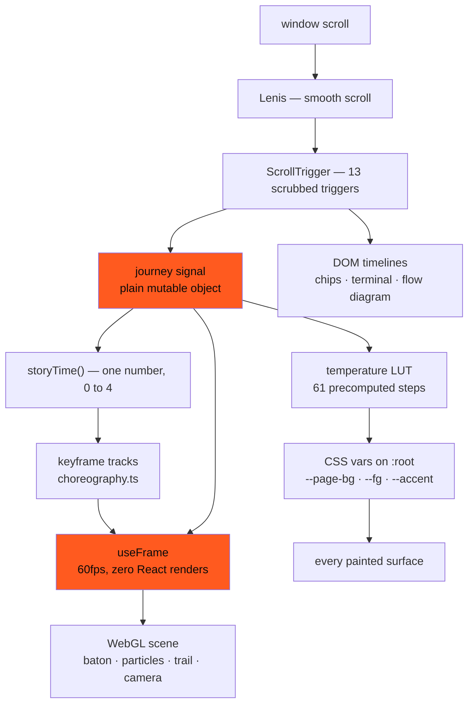

# BATON

**Your phone captures, thinks on-device, and hands the finished work to your desk.**

Pitch site and working prototype for the **iQOO Hackathon 2026 — City Battle 03, Chennai**.

| Route   | What it is                                                                                   |
| ------- | -------------------------------------------------------------------------------------------- |
| `/`     | The pitch. A scroll-driven, WebGL, three-act story: **capture → think → handoff**.           |
| `/desk` | The desktop prototype. Where batons land — summary, action items, drafted reply, provenance. |

Embedded in both: a **live on-device demo** that loads a real instruct model into the visitor's
own browser and streams a grammar-constrained run, with `bytes sent to any server: 0` beside it.

```bash
npm install
npm run dev                  # http://localhost:3000
npx next dev -H 0.0.0.0      # phone on the same Wi-Fi: http://<your-ip>:3000
npm run build && npm start
```

<details>
<summary><b>Note for exFAT volumes (external SSDs)</b></summary>

Turbopack's on-disk cache writes fine on the first run and then fails to reopen:
`Failed to open database — invalid digit found in string`. `next.config.ts` disables it
(`experimental.turbopackFileSystemCacheForDev` / `…ForBuild`) and gives dev its own `distDir`
(`.next-dev`) so `dev` and `build` never contend. You should never need to `rm -rf .next`.
On APFS you can have the cache back with `BATON_FS_CACHE=1 npm run dev`.

</details>

---

## The one idea

The page is a single continuous **handoff**. One glowing baton is born in the hero, travels down
the page through three acts, and docks into the desk world. The palette travels with it — warm
ember/near-black at the top (phone, pocket, movement), cooling to porcelain/ice at the handoff
(desk, calm, arrival). Everything else is deliberately restrained so that one move lands.

The scroll _is_ the product story, so the architecture's whole job is to make one number —
scroll position — drive geometry, camera, shaders, DOM and the colour system at 60fps without
React ever re-rendering.

---

## Architecture



**The rule that shapes everything:** scroll values never become React state. `lib/journey.ts`
exports one mutable object; ScrollTrigger writes to it, `useFrame` reads it. A `setState` at
60fps would reconcile the entire section tree on every frame of every scroll.

```ts
export const journey = {
  hero: 0, // 0→1 as the hero scrolls away
  act1: 0, // 0→1 across CAPTURE
  act2: 0, // 0→1 across THINK
  act3: 0, // 0→1 across HANDOFF
  temp: 0, // 0 warm → 1 cool
  fade: 0, // dips the stage across the PROBLEM beat
  exit: 0, // dissolves the canvas before the cool zone
  px: 0,
  py: 0, // pointer parallax
  time: 0, // advanced by the render loop, not Date.now()
};
```

### The story clock

The four acts run in document order and each saturates before the next begins, so **their sum is
a monotonic 0 → 4 clock**:

```
0 ─── hero ───1─── ACT I ───2─── ACT II ───3─── ACT III ───4
     baton born      capture        think        handoff   docked
```

Every 3D keyframe is authored against that single number. No per-act timelines to keep in sync,
no cascade of conditionals — one `storyTime()` call feeds every track.

---

## The 3D system

**One `<Canvas>` for the entire page.** Scenes are staged by scroll progress rather than mounted
and unmounted, so there is no context churn and no shader recompile mid-story.

**All geometry is procedural.** No downloaded GLB, no HDR, no texture files — the entire 3D
payload is code.

### Scene graph

```
<Canvas>  fov 38 · dpr [1, 1.75] · NoToneMapping · alpha
│
├── StageClock          advances journey.time, owns canvas opacity
├── Rig                 camera track + ±3° pointer parallax
├── Lights              ember rim + cool fill, both lerped by temperature
├── ProceduralEnvironment   64×32 canvas gradient → equirect env map (high tier only)
├── ParticleField       3,600 / 1,200 points, drift computed in the vertex shader
├── GroundFog           one radial-gradient plane
├── DeviceForms         phone slab · desk slab · light trail
└── Baton               glass shell + emissive core + additive glow billboard
```

### Procedural geometry

| Object       | How it is built                                                                   |
| ------------ | --------------------------------------------------------------------------------- |
| Baton        | Cylinder + two hemisphere caps, `mergeGeometries` → **one draw call**, one buffer |
| Device forms | 2D `Shape` with quadratic corners → `ExtrudeGeometry` with a bevel (rounded slab) |
| Light trail  | `TubeGeometry` along a `CatmullRomCurve3` between the phone and desk anchors      |
| Ground fog   | A single plane; the falloff is entirely in the fragment shader                    |
| Particles    | `BufferGeometry` of points + per-particle `aSeed` / `aScale` attributes           |

Device forms are **stylised slabs, not handset replicas** — no photoreal iQOO renders, and the
abstraction reads better at the scale they appear.

### Shaders

Six custom GLSL materials. All of them share one `tempMix()` helper so the ember→ice crossfade is
defined once.

| Shader     | Does                                                                                    |
| ---------- | --------------------------------------------------------------------------------------- |
| `core`     | Emissive filament: 4s breathing pulse, ACT II ripple along the long axis, fresnel rim   |
| `glow`     | Additive billboard behind the baton — the page's **entire** bloom budget, no post chain |
| `particle` | Drift as three offset sines in the **vertex** shader; per-particle temperature offset   |
| `trail`    | Draws itself: `uProgress` front, bright head, travelling dashes, radial edge softening  |
| `screen`   | Device screens: top-edge glow, a band of "work" moving down, faint scanline             |
| `fog`      | Squashed radial falloff for the ground haze                                             |

Particle motion never touches the CPU. Positions are static in the buffer; the vertex shader
displaces them from `uTime` and a per-particle seed, so **CPU cost per frame is four uniform
writes regardless of particle count**.

```glsl
float t = uTime * 0.09 + aSeed * 6.2831853;
pos.x += sin(t * 1.13) * 0.32;
pos.y += cos(t * 0.87) * 0.28;
pos.z += sin(t * 0.61) * 0.24;
```

### The baton

Three layers, and the ordering is load-bearing:

1. **Shell** — `MeshPhysicalMaterial`, `transmission: 0.92`, `thickness: 0.45`, `ior: 1.46`,
   clearcoat, with `attenuationColor` tinted ember so light passing through picks up warmth.
2. **Core** — a smaller merged capsule running the emissive shader, additive.
3. **Glow** — a plane whose quaternion is copied from the camera each frame (billboard without
   pulling in a helper).

> **Gotcha worth knowing.** Transmission resolves against a pre-pass that the core's additive
> draw never survives, so an inner mesh rendered normally is invisible against a dark background.
> The core is drawn **after** the shell (`renderOrder: 3`) with `depthTest: false` and composited
> on top. That is the only way the filament reads consistently.

### Camera

`CAMERA_TRACK` dollies 6.3 → 4.5 → 5.5 across the story. Pointer parallax orbits ±3° and is
damped frame-rate independently:

```ts
angle.y = damp(angle.y, journey.px * 0.052, 4, dt);
camera.position.x = Math.sin(angle.y) * z;
camera.lookAt(target);
```

On touch there is no cursor, so it falls back to a slow autonomous drift — **we never request
device-orientation permission** for a decoration.

### Responsive 3D

Portrait phones cannot hold the desktop's spread, so the whole scene is remapped rather than
merely scaled:

```ts
layoutForAspect(aspect) → {
  spreadX: narrow ? 0.45 : …,   // squeeze horizontally
  ySpread: narrow ? 0.34 : 1,   // flatten the journey into a band
  offsetY: narrow ? 2.9  : 0,   // lift that band above the copy
  zoom:    narrow ? 1.32 : 1,   // pull the camera back
}
```

On a phone the acts become copy with a 3D ribbon across the top, not copy sitting on top of 3D.

### Quality tiers

An FPS governor samples for two seconds after load and downgrades **once**, silently — one-way,
so it can never oscillate mid-scroll.

|                  | `high`                                | `low`                  |
| ---------------- | ------------------------------------- | ---------------------- |
| Particles        | 3,600                                 | 1,200                  |
| Baton shell      | `MeshPhysicalMaterial` + transmission | `MeshStandardMaterial` |
| Environment map  | yes                                   | no                     |
| Antialias        | on                                    | off                    |
| Capsule segments | 48                                    | 28                     |

The material swap is not about fill rate — `MeshPhysicalMaterial` compiles a far larger program
(transmission, clearcoat, iridescence branches), and **shader compilation is the single most
expensive thing this scene does on a weak device**.

---

## Motion and animation

### ScrollTrigger topology

Thirteen triggers at runtime, each with exactly one job:

| Trigger               | ×   | Range                      | Writes                                |
| --------------------- | --- | -------------------------- | ------------------------------------- |
| `#hero`               | 1   | top top → bottom top       | `journey.hero`                        |
| `#problem`            | 1   | top 78% → bottom 22%       | `journey.fade` = `sin(p·π)`           |
| `#act-N` progress     | 3   | top top → bottom bottom    | `journey.act1/2/3`                    |
| `#act-N` fade in      | 3   | top bottom → top top       | stage opacity `ease(p)`               |
| `#act-N` fade out     | 3   | bottom bottom → bottom top | stage opacity `1 − ease(p)`           |
| `#act-3` exit         | 1   | bottom bottom → bottom top | `journey.exit` — dissolves the canvas |
| `#temperature-window` | 1   | top bottom → bottom bottom | `journey.temp` + the token LUT        |

### Pinning: CSS sticky, not ScrollTrigger `pin`

```css
.act {
  min-height: 270vh;
} /* 210vh on phones */
.act-stage {
  position: sticky;
  top: 0;
  min-height: 100svh;
}
```

No pin-spacers, no layout reflow at trigger boundaries, and the mobile pass becomes a CSS height
change instead of a second timeline.

### Act crossfades

A sticky stage unsticks over its own height, so consecutive acts always share a one-viewport
window where the outgoing content slides up and the incoming slides in, both cropped. The two
fades are **complementary over exactly that window** — `out = 1 − e`, `in = e` — so the pair
always sums to one and the seam reads as a dissolve.

Fading one out _before_ the other starts leaves a frame of empty page. Very obvious on a phone,
where the window is most of the act. (This is also why mobile acts are 210vh, not the 165vh that
a naive "40% shorter" pass would give: at 165vh the crossfade was 60% of the scroll.)

### Hold keyframes

Each act has a **hold** key near its end:

```ts
{ t: 2.0,  x: 0.12, … },   // ACT II mark — in the gutter between readout and copy
{ t: 2.72, x: 0.16, … },   // hold: stay there while the section is read
{ t: 3.0,  x: -1.42, … },  // then depart, during the crossfade
```

Without one, the baton drifts toward the next act's mark for the whole act and spends the middle
of it behind that act's copy.

### The temperature shift

`lib/temperature.ts` precomputes a **61-step lookup table** of every design token between the two
palettes. The scrub snaps to the nearest step and bails out when the step has not changed — which
is most frames.

The important part is that the two halves use **different curves**:

```ts
const surfaceCurve = (t) => t * t * (3 - 2 * t); // smoothstep — eases across
const inkCurve = (t) => (t < 0.52 ? 0 : 1); // a hard cut
```

Interpolate both linearly and foreground and background meet in the middle as _the same mid-grey_
— the copy briefly vanishes. Surfaces ease; ink cuts over in one step as the background passes 50%
lightness. During a scrubbed scroll the cut is imperceptible; the contrast never is.

### DOM choreography, synced to the same triggers

- **ACT I** — capture chips scatter into a field, then collapse into the point where the baton
  sits. Pure DOM, not drei `<Html>`: crisper text and free for the renderer. Scatter offsets are a
  share of the field's box with `invalidateOnRefresh`, so they survive resize.
- **ACT II** — the terminal types itself with a scrubbed `clip-path: inset(0 100% 0 0)` rather
  than a character timer, so it **reverses cleanly** when you scroll back up.
- **ACT III** — flow nodes and connector lines draw in, then hold while the trail finishes and the
  page cools.

### The hero set-piece

GSAP `SplitText` assembles the headline once — characters slide up with a slight per-char rotation
inside line masks, ≤900ms, never looping. Two guards:

- It waits **two frames** so the h1 (the LCP element) paints from server HTML first.
- If GSAP arrives more than 500ms late — slow network, slow device — **the animation is skipped
  entirely**. An entrance that hides text a second after you started reading is worse than no
  entrance, and it would gate LCP behind the animation's duration.

### Button8D — eight behaviours

1. **Magnetic pull** — 90px radius, max 8px, lerped, springs back. One shared `pointermove`
   listener and one rAF loop for every button on the page, with cached rects (registering per
   button means N listeners and N forced reflows per frame).
2. **3D tilt** — `perspective(600px)`, up to 7°, tracking the cursor across the face.
3. **Layered depth** — shadow plate · body · sheen; the plate separates 5px → 8px on hover.
4. **Specular sweep** — a 600ms diagonal highlight, once per hover-enter, replayed by remount key.
5. **Press physics** — the stack compresses to `scale(0.97) translateY(2px)`, shadow collapses.
6. **Edge glow** — inner border brightens on hover, outer glow only while pressed.
7. **Focus** — a real 2px ring at 3px offset. Never glow alone.
8. **Touch** — no magnet, no tilt; press physics and sweep stay; every hit target ≥44px.

All eight are verified by an automated suite, including that the tilt is symmetric across all four
quadrants and that touch produces neither magnet nor tilt.

### Reduced motion

Not a degraded page — a different, complete one. Lenis off, every scrub off, canvas never mounts,
acts become ordinary stacked sections. The temperature still **snaps** at the handoff, because
without it the cool-zone sections would render on obsidian and lose their contrast.

---

## Performance

Lighthouse, mobile preset, against `next start` (medians of three runs):

| Page    | Performance | Accessibility | Best practices | SEO | CLS | TBT    |
| ------- | ----------- | ------------- | -------------- | --- | --- | ------ |
| `/`     | 93          | 100           | 100            | 100 | 0   | ~110ms |
| `/desk` | 96          | 100           | 100            | 100 | 0   | ~30ms  |

- **First-load JS ~145 KB gzipped**, excluding the lazy 3D and WebLLM chunks.
- **LCP is the hero headline** — real observed LCP **1.03s** under 4× CPU / 1.6 Mbps throttling.
  The canvas fades in _behind_ text that has already painted.
- **GSAP, Lenis, Three/R3F and WebLLM all load after paint.** GSAP is only ever needed inside an
  effect, so importing it lazily keeps ~46 KB off the critical path.
- **The WebGL scene arms on the visitor's first sign of presence** — scroll, pointer move, key,
  tap. Building it is one long main-thread task; doing that during hydration cost **4,000ms of
  TBT and a Lighthouse score of 62**. It buys nothing, because the 3D exists to tell a _scroll_
  story, and until someone scrolls the static composition is the design.

### Fallbacks, all verified

| Condition                | What happens                                                                                |
| ------------------------ | ------------------------------------------------------------------------------------------- |
| No WebGL                 | Styled CSS composition — ember field, CSS baton, anchored to the hero. Never a blank space. |
| `prefers-reduced-motion` | No Lenis, no scrub, no canvas; palette snaps at the handoff                                 |
| No WebGPU                | Demo runs in badged simulation mode                                                         |
| Slow device              | Render tier downgraded once by the FPS governor                                             |

---

## The live demo

- Feature-detects WebGPU by **actually requesting an adapter** — `navigator.gpu` existing is not
  the same as WebGPU working.
- `@mlc-ai/web-llm` runs `Llama-3.2-1B-Instruct-q4f16_1` in a **Web Worker**, so the decode loop
  never touches the thread driving the page. Weights (~700 MB) download **only on an explicit
  click**, with a progress bar and a plain-language notice, cached in IndexedDB.
- **Decoding is grammar-constrained** to a JSON schema via XGrammar. A 1B model asked politely for
  three prose sections will happily emit `Owner: Priya` as a summary bullet and put every action on
  the same person; constrained to a schema it _cannot_ — the tokens that would break the shape are
  not sampleable. The prompt then spends its whole budget on content quality.
- **Simulation mode** when WebGPU is absent: the same UI plays a pre-written run at a believable
  token rate, badged `simulated preview` throughout. Pasted text gets an _extractive_ script built
  from the visitor's own sentences. A failed real run falls back mid-click rather than stranding
  anyone on an error.
- Output renders through the **same `BatonCard` component `/desk` uses**, then can be handed to
  the desk for real.

---

## What is real, and what is claimed

- **On-device stack** — the phone build targets **LiteRT-LM** with a **Gemma 3n E2B/E4B-class**
  model, NPU-accelerated, GGUF/llama.cpp as the fallback path. The deprecated MediaPipe LLM
  Inference API is not part of this.
- **Office Kit** — there is no public third-party API and none is claimed. BATON is _designed
  around_ the flow: it produces a file plus a block of text, which is exactly what clipboard sync
  and file drop already carry between an OriginOS 6 phone and a desk.
- **Thermals** — on-device AI's real constraint is heat. BATON runs in short bursts and cools
  between them, the workload the iQOO 15's NPU and vapor chamber are built for. Stated as a
  constraint we designed around, not a feature.
- **The browser demo** runs WebLLM over WebGPU because that is the runtime a browser has. Same
  thesis, different runtime — not a claim that the phone build uses WebLLM.
- **Zero cloud.** No AI request leaves the device anywhere in this codebase. The only network
  endpoint is `POST /api/waitlist`.

---

## Layout

```
app/
  page.tsx                 warm zone (#story) then the opaque cool zone
  desk/page.tsx            the dashboard prototype
  api/waitlist/route.ts    POST { email } — validated, rate-limited, best-effort log
  globals.css              tokens, both temperature palettes, the 8D button
  fonts.ts                 Technor (variable) · Satoshi · JetBrains Mono, self-hosted
components/three/
  Scene.tsx                rig, lights, environment, ground fog, stage clock
  Baton.tsx                shell + core + glow billboard
  DeviceForms.tsx          phone slab, desk slab, light trail
  ParticleField.tsx        GPU-driven point field
  choreography.ts          keyframe tracks + the responsive layout remap
  geometry.ts              merged capsule, extruded rounded box
  shaders.ts               all six GLSL programs
components/story/
  ScrollDirector.tsx       the only writer of the journey signal
lib/
  journey.ts               the scroll signal + the 0→4 story clock
  temperature.ts           the 61-step warm→cool token LUT
  capability.ts            WebGL/WebGPU detection, FPS governor, quality tiers
  pointerField.ts          one shared magnet loop for every button
  demo/                    engine · worker · prompt · schema · parser · simulation
  team.ts                  ← names, roles and links live here
```

---

## Two things to know before touching the 3D

1. **R3F hands `ShaderMaterial` its uniforms through the constructor, and three clones them
   there.** Per-frame writes must go through `materialRef.current.uniforms` — mutating the object
   you passed in silently does nothing. This cost an afternoon; every animated uniform in the
   scene now goes through a material ref.
2. **`smoothstep(a, b, x)` with `a > b` is undefined in GLSL.** Some drivers return what you
   expected, some return NaN, and NaN propagates until the whole mesh disappears. Every falloff
   here is written as `1.0 - smoothstep(lo, hi, x)`.

---

Built by **Het Patel** and **Utkarsh Rajput** for the iQOO Hackathon 2026, City Battle 03, Chennai.
